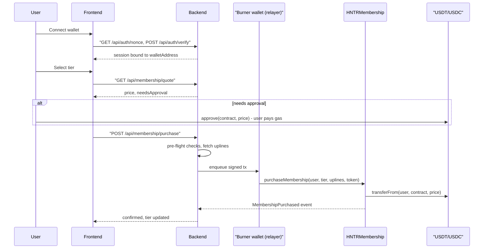

> **Status: fully implemented.** Every todo below has shipped in contracts/backend/frontend and both `npm run build` (frontend) and `npx tsc --noEmit` (backend) are clean. See "Final Deploy & Setup Commands" at the bottom for the exact commands to deploy and run this end to end. Two things were deliberately **not** faked: "HNTR Points" and 5 of the 6 "Active Rewards Tiers" cards (Leadership Bonus, Rank Bonus, NFT Strategy Rewards, OTC Desk, Liquidity Provider) have no backing on-chain feature yet, so they're shown as honest `$0.00` / "COMING SOON" states instead of invented numbers. Only "Referral Commissions" (backed by `withdrawableCommissions`/`lockedCommissions`) is real and claimable today.


# Membership Purchase: Full Backend + Frontend Integration Plan

## Root cause (confirmed by code review)

`purchaseMembership` / `upgradeMembership` / `withdrawCommissions` in [HNTRMembership.sol](hntr/src/HNTRMembership.sol) are gated by `onlyBurnerWallet`, but payment is still `IERC20(token).safeTransferFrom(user, address(this), amount)` (line 126) — funds come from, and the membership record (`users[user]`) belongs to, the real user. **Ownership is not the problem.** The actual problems are:

1. **Nothing implements the relay end-to-end today.**
   - Backend (`hntr-backend/src/services/contract.service.ts`) only wires the burner wallet for `withdrawCommissions` (via `POST /api/network/claim`). No route ever calls `purchaseMembership`/`upgradeMembership`.
   - Backend's hardcoded ABI (lines 137-158, 308-318 of `contract.service.ts`) is **stale** — it matches an older contract without `user`/burner-gating at all, and `CONTRACT_ADDRESS`/`RPC_URL` are hardcoded instead of read from [env.ts](hntr-backend/src/config/env.ts), so it's currently likely pointed at an old deployment.
   - Frontend (`hntr-web-nextjs/app`) has **no wallet library, no ABI, no approve call, no purchase API call at all** — `selectTier` in `membership/page.tsx` just does `console.log`, and the "success" modal in `script-8.js` fires unconditionally.
2. **The deploy script never configures the contract.** [DeployHNTRMembership.s.sol](hntr/script/DeployHNTRMembership.s.sol) never calls `setWallets(...)` or `setBurnerWallet(...)` after deployment. Since `burnerWallet` defaults to `address(0)`, and `address(0)` can never be `msg.sender`, **every purchase/upgrade/claim call reverts forever** on a freshly deployed contract until an owner manually configures it. This must be fixed regardless of anything else.
3. **`POST /api/network/claim` currently trusts an unauthenticated `walletAddress` in the request body** — anyone can make the burner spend gas "claiming" for any address (funds still land correctly on-chain, but it's a free gas-griefing vector and the same gap would apply to the new purchase/upgrade endpoints if not fixed).

## Decision (confirmed with you)

Keep the **burner-relayer pattern** for `purchaseMembership`, `upgradeMembership`, **and** `withdrawCommissions`:
- User signs their own `approve(HNTRMembership, amount)` on USDT/USDC (the only tx that must come from the user's own wallet/gas).
- Backend's burner wallet relays the actual `purchaseMembership`/`upgradeMembership`/`withdrawCommissions` call (gasless for the user; backend supplies the trusted `uplines` array from the off-chain referral tree).
- **No contract redeploy of the access-control logic is required.**

## 1. Smart contract (`hntr/`)

No changes to `purchaseMembership`/`upgradeMembership`/`withdrawCommissions` signatures or modifiers — they stay as-is.

Required fix (deployment, not contract logic):
- Update [DeployHNTRMembership.s.sol](hntr/script/DeployHNTRMembership.s.sol) to call `setWallets(treasury, leadership, achievement, pool)` and `setBurnerWallet(burnerAddress)` immediately after `new HNTRMembership(...)`, reading all five addresses from env vars (fail fast with `vm.envAddress` if unset). Add a post-deploy `console2.log` sanity check and a short smoke test (`purchaseMembership` dry run against a throwaway account) before treating a deployment as production-ready.

Optional hardening (flag for your decision, not required for MVP):
- Single `burnerWallet` address is a single point of failure — if that one key is lost/rotated/rate-limited, purchases halt entirely with no code change possible short of an owner tx. Consider (in a future iteration, not blocking this integration) replacing the single address with a `mapping(address => bool) relayers` + `addRelayer`/`removeRelayer` (`onlyOwner`) so multiple relayer keys can be rotated/added without downtime. Not doing this now per your decision to keep the current model unchanged; mitigate operationally instead (see Section 4).

## 2. Backend (`hntr-backend/src`)

### 2.1 Fix existing wiring bugs
- [contract.service.ts](hntr-backend/src/services/contract.service.ts): read `CONTRACT_ADDRESS`/`RPC_URL`/`PRIVATE_KEY` from `ENV` (`env.ts`) instead of hardcoded literals. Replace the hand-maintained `contractABI` array with the real compiled ABI (Foundry `out/HNTRMembership.sol/HNTRMembership.json`), so it can never drift from `IHNTRMembership.sol` again — e.g. copy/sync it into `hntr-backend/src/abi/HNTRMembership.json` as part of a build step.
- Harden `POST /api/network/claim` ([network.controller.ts](hntr-backend/src/controllers/network.controller.ts)) so it only relays for the **authenticated caller's own wallet**, not an arbitrary `req.body.walletAddress`.

### 2.2 Add wallet-based authentication (SIWE-style)
New minimal auth so every relay endpoint can trust `walletAddress`:
- `GET /api/auth/nonce?walletAddress=0x..` → generate + store a one-time nonce.
- `POST /api/auth/verify` with `{ walletAddress, signature }` → `ethers.verifyMessage(nonceMessage, signature)`, issue a short-lived session (JWT or signed cookie) bound to `walletAddress`.
- Add an `requireWalletAuth` middleware; apply it to `/api/membership/*` and `/api/network/claim`.

### 2.3 New relay endpoints
- `GET /api/membership/quote?tier=&token=` — returns price (from a mirrored `tierPrices` table or a live `getUser`/`tierPrices` view call), current on-chain allowance/balance for the caller, and a boolean `needsApproval`. Lets the frontend decide whether to prompt `approve` first without guessing.
- `POST /api/membership/purchase` `{ tier, token }` (walletAddress comes from the auth session, never the body):
  1. Reject if DB/on-chain `getUser(walletAddress).tier != NONE` (idempotency — avoid burner gas on a call that will revert).
  2. Pre-flight `allowance(walletAddress, CONTRACT_ADDRESS)` and `balanceOf(walletAddress)` checks via a read-only ERC20 call; return a clear `NEEDS_APPROVAL` / `INSUFFICIENT_BALANCE` error instead of burning burner gas on a doomed tx.
  3. Fetch `uplines` via the existing `NetworkService.getUplines(username)`.
  4. Create a `Transaction` doc with status `PENDING`, then call `hntrContractWithSigner.purchaseMembership(walletAddress, tier, uplines, token)` through a **serialized burner-wallet tx queue** (see 2.4), `await tx.wait()`, update the record to `CONFIRMED`/`FAILED`.
  5. Return `{ txHash }`; the existing `blockchain.service.ts` event listener remains the source of truth that finalizes `User.tier` from the `MembershipPurchased` event.
- `POST /api/membership/upgrade` `{ newTier, token }` — same shape, validates `newTier > current tier` before relaying `upgradeMembership`.

### 2.4 Burner wallet reliability (this is what actually fixes the "users can't buy" risk operationally, since the access model itself isn't changing)
- Serialize all burner-signed writes (`purchaseMembership`, `upgradeMembership`, `withdrawCommissions`) through a single in-process queue (or `ethers` `NonceManager`) so concurrent requests don't collide on nonce.
- Add a scheduled balance check (extend [leadership-cron.ts](hntr-backend/src/jobs/leadership-cron.ts) pattern) that alerts (log/Slack/webhook) when the burner wallet's native-gas balance drops below a threshold — this is the single point of failure the contract's `onlyBurnerWallet` creates, so it needs an ops safety net rather than a contract change.
- Make `Transaction` writes idempotent (unique constraint on `walletAddress` while a `PENDING` purchase exists) so a backend restart mid-flight can't double-submit.

### 2.5 Protocol wallet generator
[wallet.service.ts](hntr-backend/src/services/wallet.service.ts) already generates the correct 5 wallets (treasury, leadership, achievement, pool, burner) but only prints them to the console. Enhance it to also write a ready-to-paste `.env` block (`TREASURY_WALLET`, `LEADERSHIP_WALLET`, `ACHIEVEMENT_WALLET`, `POOL_WALLET`, `PRIVATE_KEY` for the burner) to a gitignored output file, and expose it as an `npm run generate:wallets` script so it's a one-command step before running the deploy script in Section 1.

## 3. Frontend (`hntr-web-nextjs/app`)

### 3.1 Real wallet connection
- Add `wagmi` + `viem` (+ a connector UI, e.g. RainbowKit or ConnectKit) to `package.json`. Configure Sepolia now via `NEXT_PUBLIC_RPC_URL` / `NEXT_PUBLIC_WALLETCONNECT_PROJECT_ID`.
- Replace the mock state in [MainLayout.tsx](hntr-web-nextjs/app/components/MainLayout.tsx) (`WALLET_ADDRESS`, `walletConnected`, `disconnectWallet`, `reconnectWallet`) with `useAccount()` / `useConnect()` / `useDisconnect()`, keeping the existing pill/panel markup.
- On connect, run the SIWE nonce/verify flow against the new backend auth endpoints and store the session.

### 3.2 Contract config
- Add `NEXT_PUBLIC_CONTRACT_ADDRESS`, `NEXT_PUBLIC_USDT_ADDRESS`, `NEXT_PUBLIC_USDC_ADDRESS`. Check in a shared ABI (mirrored from the Foundry `out/` artifact, same one used by the backend) under e.g. `lib/abi/`.

### 3.3 Real purchase/upgrade flow
Replace the mock in [membership/page.tsx](hntr-web-nextjs/app/membership/page.tsx) `selectTier` and the instant-success modal in `script-8.js`/[SignupOverlays.tsx](hntr-web-nextjs/app/components/SignupOverlays.tsx):
1. `GET /api/membership/quote` → price + `needsApproval`.
2. If needed, `approve(contractAddress, price)` on the USDT/USDC contract directly from the user's wallet via `useWriteContract` (user's own gas — the one on-chain step that must be user-signed), wait for confirmation via `useWaitForTransactionReceipt`.
3. `POST /api/membership/purchase` (or `/upgrade`), then poll/subscribe for the resulting event/DB state, then show the existing success modal with real data (amount, tier, tx hash) instead of static copy.
4. Wire [network/page.tsx](hntr-web-nextjs/app/network/page.tsx)'s `UPGRADE` button (and [DepositModal.tsx](hntr-web-nextjs/app/components/DepositModal.tsx)) to the same real upgrade flow instead of just `router.push("/membership")`.
5. Wire the commission-claim UI to `POST /api/network/claim` (now auth-protected) with real confirmation state.
6. Handle and surface: insufficient balance/allowance, already-a-member, wrong chain, in-flight tx (disable double submit), and a clear "relayer temporarily unavailable, your funds are safe" state if the backend/burner is down.

### 3.4 Referral wiring
- `SignupOverlays.tsx`'s disabled sponsor field → parse `?ref=` from the URL or accept manual entry, pass `sponsorUsername` through to the existing `POST /api/users/register`.

### 3.5 Dynamic referral/network page
[network/page.tsx](hntr-web-nextjs/app/network/page.tsx) is currently 100% hardcoded (username `masteraccount`, rank, `RANGER` tier, `$11,955.14` totals, static referral link `hntr.net/ref/0x71c...492`, static `transactions` array, static rewards-tier amounts). Wire it to:
- `GET /api/users/wallet/:walletAddress` (existing) for profile/tier/rank/progress.
- `GET /api/network/:username/downline` (existing) for team/topology data feeding the plexus canvas.
- `GET /api/network/transactions/:walletAddress` (existing) for the Transaction History table (replacing the static `transactions` array), with real pagination instead of the static "Showing 1-4 of 1,244" footer.
- Referral link/QR generated from the authenticated user's own `username`/`walletAddress` (e.g. `hntr.net/ref/{username}`), not the hardcoded `0x71c...492`.
- "Active Rewards Tiers" card amounts sourced from `withdrawableCommissions`/`lockedCommissions` (via a small backend aggregation endpoint, e.g. `GET /api/network/:walletAddress/rewards-summary`) instead of static `$4,230.12` style numbers; wire the `CLAIM` buttons to the authenticated `POST /api/network/claim` flow from 3.3.
- Membership stat card driven by real `getUser`/DB tier instead of the hardcoded `RANGER` string.

### 3.6 Dynamic right rail / dashboard sidebar
The right rail in [MainLayout.tsx](hntr-web-nextjs/app/components/MainLayout.tsx) (`renderProfileCard`, `renderRightRail`) is also fully hardcoded (`masteraccount`, `Elite Hunter`, `74%` progress, `$11,955.14` Total Rewarded, `6,913,586` HNTR Points, `$4,230.11` Referral Commission, `$1,844.28` Pool Rewards). Once wallet auth exists (3.1), fetch the same profile/rewards-summary data used in 3.5 once (e.g. a shared `useDashboardData()` hook / React Query cache) and reuse it here so the rail and the network page never disagree, and wire its `CLAIM` buttons to the same claim flow.

## 4. Sequencing / rollout

1. Run `npm run generate:wallets` (Section 2.5) to produce the 5 protocol wallet addresses/keys.
2. Fix deploy script (Section 1) + redeploy to a fresh Sepolia address, passing the generated wallet addresses so `setWallets`/`setBurnerWallet` are configured atomically at deploy time — do this first, since nothing else can be tested against a misconfigured contract.
3. Backend: fix ABI/env wiring, add auth, add the two relay endpoints, harden `/claim`, add nonce queue + balance alerting.
4. Frontend: wallet connect + SIWE, then approve+purchase flow, then upgrade/claim wiring, then dynamic network page + right rail (3.5, 3.6).
5. End-to-end test on Sepolia with mock USDT/USDC before touching mainnet config.



## 5. Final Deploy & Setup Commands

Run these in order. Steps 1-2 only need to be repeated when you want a **fresh** contract deployment (new wallets / new address); if you're keeping the existing Sepolia deployment (`0xd0930a746470f8555b18B7afdf118FAd05A71a00`) that already has wallets configured, skip straight to step 3.

### 5.1 Generate the 5 protocol wallets (backend)

```bash
cd hntr-backend
npm install
npm run generate:wallets
```

This prints all 5 addresses/keys to the console and also writes `hntr-backend/generated-wallets.env` (gitignored) with the exact lines to paste in the next two steps. **Save the 4 non-burner private keys somewhere secure (a secrets manager, not this file) — they're only needed later to move funds out of treasury/leadership/achievement/pool, not for day-to-day operation.**

### 5.2 Deploy `HNTRMembership` and configure it atomically (contracts)

In `hntr/.env`, paste the 5 `..._WALLET` address lines from `generated-wallets.env` (keep the existing `PRIVATE_KEY` — that's the **deployer** key, separate from the burner key) alongside the existing `SEPOLIA_RPC_URL`:

```bash
cd hntr
forge build
forge script script/DeployHNTRMembership.s.sol:DeployHNTRMembership --rpc-url <your-sepolia-rpc-url> --broadcast --verify
```

`PRIVATE_KEY` and `ETHERSCAN_API_KEY` don't need to be exported manually — Foundry auto-loads `hntr/.env` for the script's `vm.env*()` cheatcodes and for `--verify`, as long as this is run from inside `hntr/`. Only `--rpc-url` needs a literal URL (or your own shell's env var syntax) since it's a plain CLI arg resolved by your shell, not a cheatcode — e.g. on PowerShell: `--rpc-url https://ethereum-sepolia-rpc.publicnode.com`.

On Sepolia the script auto-deploys fresh mock USDT/USDC and mints 1,000,000 of each to the deployer, then immediately calls `setWallets(...)` and `setBurnerWallet(...)` in the same broadcast — the two `require` checks at the end fail loudly if anything is still unconfigured. Copy the logged `HNTRMembership deployed at:` address plus the mock USDT/USDC addresses for step 5.3.

### 5.3 Configure and run the backend

In `hntr-backend/.env` (create it from `hntr-backend/.env.example` if it doesn't exist yet), set:
- `PRIVATE_KEY` — the **burner** wallet's private key from `generated-wallets.env`
- `CONTRACT_ADDRESS` — the address logged in 5.2
- `USDT_ADDRESS` / `USDC_ADDRESS` — the mock token addresses logged in 5.2
- `RPC_URL` — same `SEPOLIA_RPC_URL` as the contracts repo
- `MONGO_URI` — your MongoDB connection string
- `JWT_SECRET` — any long random string (required in production; a dev default is used otherwise)

Then fund the burner wallet with a small amount of Sepolia ETH (it pays gas for every relayed purchase/upgrade/claim) and start the server:

```bash
cd hntr-backend
npm install
npm run dev        # or: npm run build && npm start
```

Watch the logs for the burner-balance monitor cron warning if the burner ever drops below `MIN_BURNER_BALANCE_WEI`.

### 5.4 Configure and run the frontend

In `hntr-web-nextjs/.env.local` (create it from `.env.local.example`), set:
- `NEXT_PUBLIC_API_URL` — the backend's URL (e.g. `http://localhost:8000`)
- `NEXT_PUBLIC_CONTRACT_ADDRESS`, `NEXT_PUBLIC_USDT_ADDRESS`, `NEXT_PUBLIC_USDC_ADDRESS` — same addresses as 5.3
- `NEXT_PUBLIC_RPC_URL` — same Sepolia RPC URL

```bash
cd hntr-web-nextjs
npm install
npm run dev         # or: npm run build && npm start
```

### 5.5 Smoke test

1. Connect a browser wallet (MetaMask etc.) pointed at Sepolia, with some Sepolia ETH and some of the mock USDT/USDC from step 5.2 (mint more to a test address with `MockERC20.mint`, or transfer from the deployer who was minted 1,000,000 of each).
2. Sign up through the signup overlay (this hits the SIWE nonce/verify endpoints, then `POST /api/users/register`).
3. Buy a tier on `/membership` — approve the token, then confirm the relayed purchase transaction hash on Sepolia Etherscan.
4. Check `/network` and the dashboard right rail both show the new tier, real progress %, and (once a downline purchases under you) a real claimable "Referral Commissions" balance with a working `CLAIM` button.
